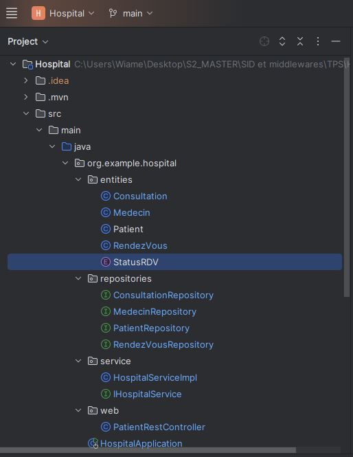
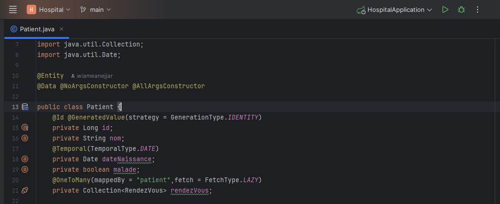
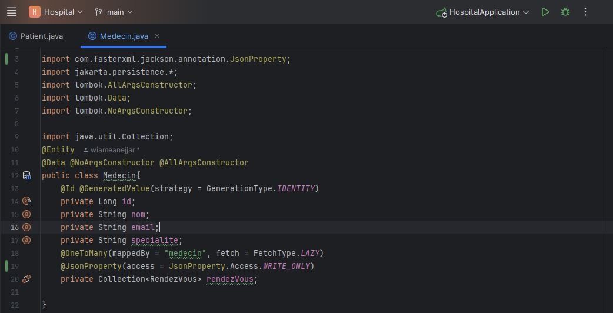
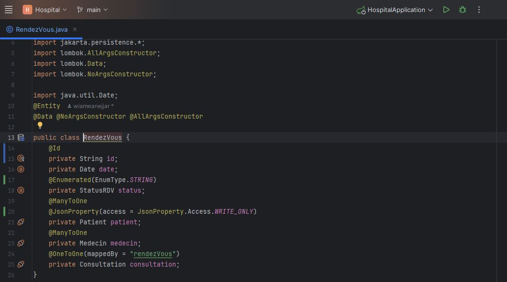
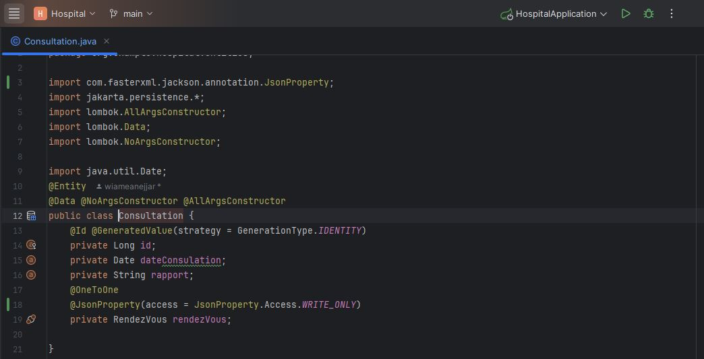
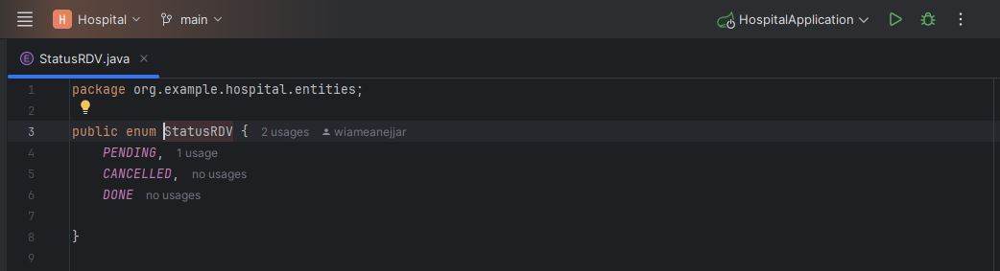

# Rapport de TP – Application de Gestion Hospitalière avec Spring Boot et JPA

## 📌 Objectif du TP

L’objectif de ce TP est de développer une application de gestion hospitalière en utilisant le framework Spring Boot et Spring Data JPA.
Cette application permet de modéliser les principales entités d’un système hospitalier, telles que les patients, les médecins, les rendez-vous, les consultations, et leur gestion au travers de services et d’un contrôleur REST.

L'application doit permettre de :
 - Gérer les entités : Patient, Medecin, RendezVous, Consultation, et StatusRDV.
 - Ajouter, consulter et modifier les données associées à ces entités.
 - Organiser les services métiers liés aux opérations de gestion hospitalière.
 - Exposer une API REST pour interagir avec le système.
 - Utiliser une base de données embarquée (H2) pour stocker les données pendant l’exécution.

---

## 🧱 Structure du Projet

Le projet suit une architecture en couches typique d’une application Spring Boot :
 - entities : contient les classes de domaine représentant les entités métier :
    - Patient, Medecin, RendezVous, Consultation, StatusRDV.
 - repositories : contient les interfaces JPA permettant l’accès aux données :
    - PatientRepository, MedecinRepository, RendezVousRepository, ConsultationRepository.
 - service : contient l’interface métier IHospitalService et son implémentation HospitalServiceImpl, qui encapsulent la logique métier.
 - web : contient les contrôleurs REST exposant les endpoints de l’application : PatientRestController.
 - HospitalApplication : classe principale avec l’annotation @SpringBootApplication qui sert de point d’entrée à l’application.

  
##📄 Explication détaillée des Classes
### 1. Classe Patient :
La classe Patient représente une entité JPA correspondant à la table des patients dans la base de données. Elle est annotée avec @Entity, ce qui indique à JPA qu’il s’agit d’une entité persistante. L’utilisation de Lombok avec @Data, @NoArgsConstructor, et @AllArgsConstructor permet de générer automatiquement les méthodes usuelles (getters, setters, constructeurs, etc.).
 - Attributs principaux :
   - id : clé primaire de type Long, générée automatiquement (@GeneratedValue).
   - nom : nom du patient (type String).
   - dateNaissance : date de naissance annotée avec @Temporal(TemporalType.DATE) pour indiquer qu’il s’agit d’un champ de type date sans l’heure.
   - malade : booléen indiquant si le patient est actuellement malade.
   - rendezVous : collection de rendez-vous associés au patient, avec une relation @OneToMany. Le champ mappedBy = "patient" signifie que la relation est gérée par l'entité RendezVous, et fetch = FetchType.LAZY optimise la performance en chargeant la collection uniquement sur demande.

  
### 2. Classe Medecin :
La classe Medecin est également une entité JPA représentant les médecins dans le système. Elle utilise les mêmes annotations Lombok que les autres entités pour générer du code standard.
 - Attributs principaux :
    - id : identifiant unique généré automatiquement.
    - nom, email, specialite : informations personnelles du médecin.
    - rendezVous : liste des rendez-vous du médecin avec une relation @OneToMany(mappedBy = "medecin"). Annotée avec @JsonProperty(access = JsonProperty.Access.WRITE_ONLY) pour empêcher son affichage lors des sérialisations JSON, évitant ainsi les cycles infinis et protégeant la structure de données.

  
### 3. Classe RendezVous :
Cette classe modélise les rendez-vous entre les patients et les médecins. Elle est reliée à plusieurs entités par des relations @ManyToOne et @OneToOne.
 - Attributs principaux :
   - id : identifiant du rendez-vous (type String).
   - date : date du rendez-vous.
   - status : statut du rendez-vous défini par une énumération StatusRDV, persisté sous forme de chaîne (@Enumerated(EnumType.STRING)).
   - patient : relation @ManyToOne avec Patient, annotée avec @JsonProperty(WRITE_ONLY) pour éviter la récursivité lors de la sérialisation.
   - medecin : relation @ManyToOne avec Medecin.
   - consultation : relation @OneToOne(mappedBy = "rendezVous"), indiquant qu’un rendez-vous peut être associé à une seule consultation.

  
### 4. Classe Consultation :
La classe Consultation représente les consultations médicales ayant lieu suite à un rendez-vous.
 - Attributs principaux :
    - id : identifiant généré automatiquement.
    - dateConsulation : date à laquelle la consultation a eu lieu.
    - rapport : rapport écrit du médecin suite à la consultation.
    - rendezVous : relation @OneToOne avec l’entité RendezVous, indiquant l’unicité du lien entre une consultation et son rendez-vous. L’annotation @JsonProperty(WRITE_ONLY) permet d’éviter que la consultation ne soit exposée avec toutes les informations du rendez-vous en JSON.

  
### 5. Enumération StatusRDV :
Cette énumération représente les différents statuts possibles d’un rendez-vous :
   - PENDING : en attente.
   - CANCELLED : annulé.
   - DONE : terminé.

Elle est utilisée dans l’entité RendezVous pour gérer l’état d’un rendez-vous via l’annotation @Enumerated(EnumType.STRING), ce qui permet de stocker le nom du statut (et non sa position) dans la base de données.

  
  
